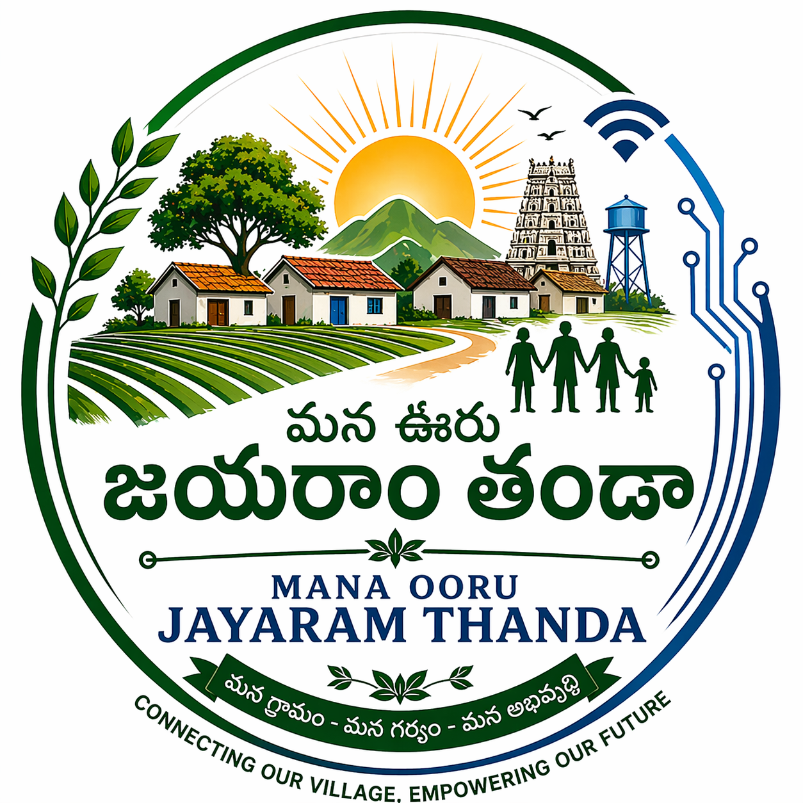
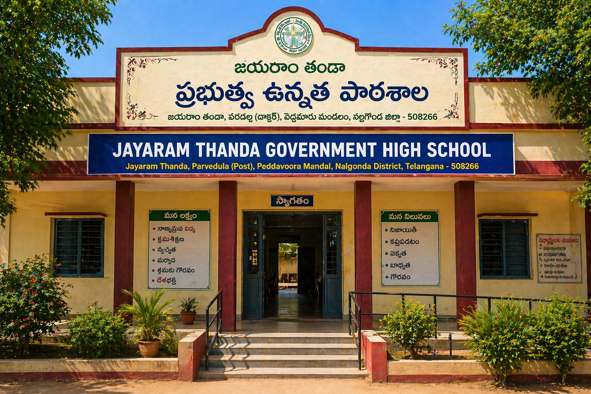
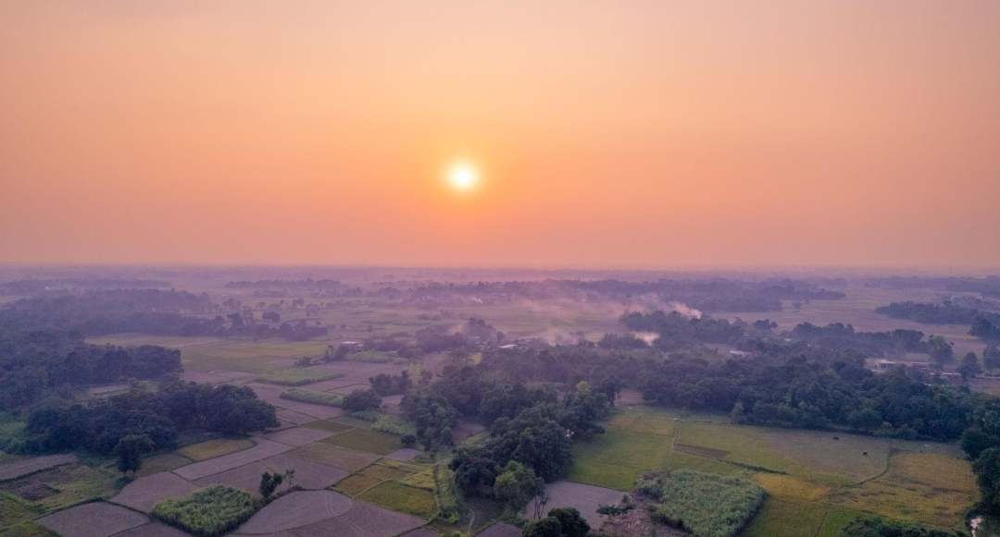
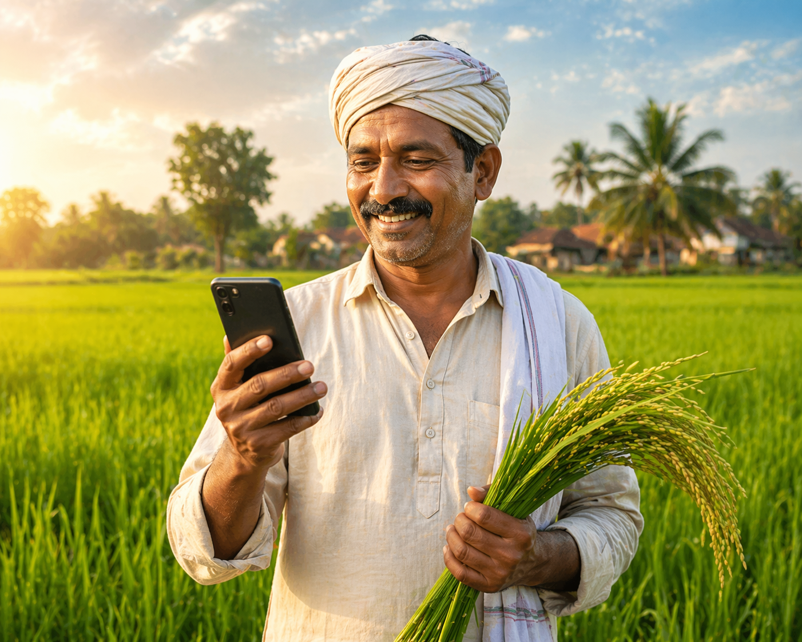

<div align="center">
  
</div>

# Mana Ooru – Jayaram Thanda

**మన గ్రామాన్ని డిజిటల్‌గా కలుపుతూ | Connecting our village digitally**

<p align="center">
  
</p>

Mana Ooru – Jayaram Thanda is a mobile-first Digital Village Platform designed to improve communication, governance, and service accessibility for rural communities. This repository contains the Frontend PWA code built with React.js and Tailwind CSS.

## Abstract
The platform integrates rural employment schemes such as Mahatma Gandhi National Rural Employment Guarantee Act (MGNREGA) and JANMANREGA, enabling villagers to access work opportunities, track payments, and participate in drought-relief (karuvu) development activities.

## Features

- **Community-Centered Design**: Simple, readable UI emphasizing the village identity.
- **Notice Board**: Important updates, events, and utility schedules from the Panchayat.
- **Important Contacts**: Quick access to essential personnel like Sarpanch, Health Workers, Police, and Ambulance.
- **Complaint System**: Easy issue reporting with status tracking for villagers.
- **Services Directory**: Information on government schemes, job updates, and farming info.
- **AI Scheme Assistant**: An intelligent Chatbot powered by NLP to answer scheme queries in Telugu.
- **AI Crop Scanner**: Computer vision endpoint to diagnose crop diseases from images.
- **PWA Ready**: Configured for offline access and mobile installation.

## Gallery

<p align="center">
  
  &nbsp;
  
</p>
## Tech Stack

- **Frontend**: React.js (Vite)
- **Styling**: Tailwind CSS
- **Icons**: Lucide React
- **PWA Setup**: vite-plugin-pwa

## Setup Instructions

1. **Install Dependencies**
   Run the following command in the terminal to install all necessary packages:
   ```bash
   npm install
   ```

2. **Run Development Server**
   Start the local server to view the application:
   ```bash
   npm run dev
   ```

3. **Build for Production**
   To create an optimized production build:
   ```bash
   npm run build
   ```

## The 5-Phase Development Roadmap

The development of Mana Ooru is strategically divided into 5 phases to ensure scalability and practical rural deployment:

### ✅ Phase 1: Frontend MVP (The Skeleton)
- **Status:** Completed
- **Technology:** React.js, Tailwind CSS, Vite PWA
- **Impact:** A mobile-first, offline-capable UI in Telugu to bridge the digital divide.

### ✅ Phase 2: Full-Stack Architecture (The Brain)
- **Status:** Completed
- **Technology:** Node.js, Express.js, SQLite
- **Impact:** Dynamic data management for real-time Notice Boards, complaints, and NREGA tracking.

### ✅ Phase 3: Hardware Integration (Smart Village IoT)
- **Status:** Completed (Digital Twin API Active)
- **Technology:** REST APIs, Node.js endpoints
- **Impact:** A live **Panchayat Dashboard** monitoring physical assets like water tank levels and street lights to prevent resource wastage.

### ✅ Phase 4: Artificial Intelligence (Automated Governance)
- **Status:** Completed
- **Technology:** NLP matching & Computer Vision API
- **Impact:** Includes an **AI Chatbot Assistant** for natural-language scheme recommendations and an **AI Crop Disease Scanner** for instant agricultural diagnosis.

### 🚀 Phase 5: Production Scale (Go-To-Market)
- **Status:** Future Scope
- **Technology:** AWS/Supabase, Physical ESP32 Sensors, Twilio WhatsApp API.
- **Impact:** Installing physical hardware in Jayaram Thanda, connecting to global cloud servers, and automating village-wide WhatsApp broadcasts.

---

## 👑 The "Digital Sarpanch" Model (Implementation Strategy)
A common challenge in rural tech adoption is the digital illiteracy of elderly village officials (Sarpanch/Secretaries). 

**Solution:** This platform introduces the role of a **Village Technology Officer (VTO)**. The educated youth who develops/maintains the software acts as the digital bridge. 
- The VTO uses their Super-Admin access to update the portal on behalf of the administration. 
- They hardcode demographic updates, manage the IoT dashboard, and push official notices.
- This ensures the technology actually gets utilized and maintained, fostering youth leadership in rural development.

## UI/UX Guidelines Followed
- **No Heavy Libraries**: Excluded Matter.js/Three.js to ensure fast loading on low-end mobile devices.
- **Large Buttons**: For improved tap targets and usability.
- **Telugu Support**: Implemented in primary content areas for better digital inclusivity.
- **Performance**: Simple static delivery initially with potential for offline first.

---

## Developer Details

**Developed By:** Ramavath Babu  
**Role:** Full Stack Developer  
**Email:** [ramavathbabu137@gmail.com](mailto:ramavathbabu137@gmail.com)  
**LinkedIn:** [linkedin.com/in/baburathod](https://www.linkedin.com/in/baburathod/)  
**GitHub:** [github.com/baburathod](https://github.com/baburathod)

*Dedicated to building inclusive, accessible, and highly optimized digital solutions for rural communities.*

